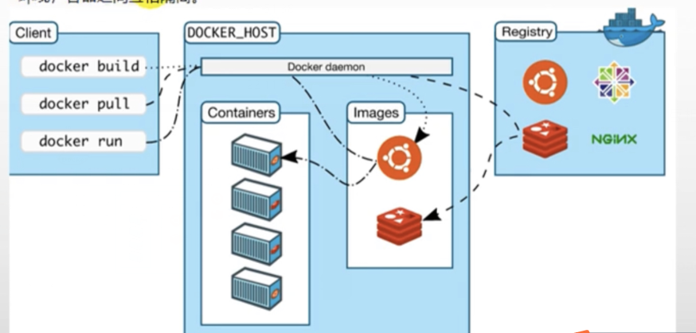

# docker


[toc]

------

## 1. docker是什么

> * docker是虚拟化容器技术，docker基于镜像，可以秒级启动各种容器，每一种容器都是一个完整的运行环境，容器之间互相隔离
>
>   【直接在linux虚拟机中安装程序的弊端】：
>
>   * 安装程序比较麻烦（源码编译等）
>   * 当软件运行期间出现问题（如mysql等），可能会重装虚拟机
>
> * docker的镜像仓库：[docker hub](https://hub.docker.com/)
>
> * docker将镜像从镜像仓库下载到本机，然后docker很容易基于下载的镜像启动一个容器
>
>   * 
>
> 

## 2. 安装docker

> * [安装官方文档](https://docs.docker.com/engine/install/centos/)
>
>   * 参考官方文档，如果有特殊需求，请详细阅读
>
>     ```shell
>     # Uninstall old versions 卸载旧版本
>     $ sudo yum remove docker \
>                       docker-client \
>                       docker-client-latest \
>                       docker-common \
>                       docker-latest \
>                       docker-latest-logrotate \
>                       docker-logrotate \
>                       docker-engine
>     
>     # Install using the repository 安装依赖包
>     $ sudo yum install -y yum-utils
>     $ sudo yum-config-manager \
>         --add-repo \
>         https://download.docker.com/linux/centos/docker-ce.repo
>         
>     # INSTALL DOCKER ENGINE 安装docker
>     $ sudo yum install docker-ce docker-ce-cli containerd.io
>     
>     # 启动 docker
>     sudo systemctl start docker
>     ```
>
> * 设置`docker`开机自启动
>
>   ```shell
>   sudo systemctl enable docker
>   ```
>
>   

## 3. docker常见命令

> ```shell
> su root
> [sudo] systemctl start docker 	# 启动docker
> docker -v 						# 查看docker版本
> [sudo] docker images 			# 检查当前虚拟机是否下载哪些镜像
> [sudo] docker pull mysql		# docker从镜像仓库中下载，如果不添加版本号默认下载最新的镜像，下载指定的版本如下：
> [sudo] docker pull mysql:5.7
> docker ps 						# 查看docker正在运行中的容器
> 
> docker exec -it id[或者names] /bin/bash	# 以交互的模式，进入安装好的容器中
> docker restart mysql					 # docker重启mysql容器
> 
> docker ps -a 							# 查看所有的容器【非镜像】
> docker update redis --restart=always 	# 配置容器随着docker启动 而 自启动
> docker logs 【容器名称】# 查看错误
> ```
>
> ```shell
> # docker 将下载的镜像启动一个容器
> su root
> docker run -p 3306:3306 --name mysql \
> -v /mydata/mysql/log:/var/log/mysql \
> -v /mydata/mysql/data:/var/lib/mysql \
> -v /mydata/mysql/conf:/etc/mysql \
> -e MYSQL_ROOT_PASSWORD=root \
> -d mysql:5.7
> 
> # 参数说明
> #	-p 3306:3306 								将docker容器的3306端口映射到linux主机的3306端口
> #	--name xxx 									为当前启动这个容器起一个名称
> #	-v 目录挂载
> #		-v /mydata/mysql/log:/var/log/mysql 	将日志文件夹挂载到主机
> #		-v /mydata/mysql/data:/var/lib/mysql    将mysql运行的数据库文件挂载到主机
> #		-v /mydata/mysql/conf:/etc/mysql  		将配置文件夹挂载到主机
> #	-e 											在启动容器时，设置参数，如：调整mysql的root的密码
> #	-d 											以后台方式运行，如：mysql:5.7 指定是哪个镜像启动的容器
> ```
>
> 


## 4. 配置docker镜像加速

> * 推荐使用阿里云镜像加速 [网址参考](https://cr.console.aliyun.com/cn-hangzhou/instances/mirrors)
>   * 登录`阿里云` ---> `控制台` --->`产品与服务`--->`容器镜像服务`--->`镜像加速器`--->然后选择对应的`linux`版本

## 5. 使用docker安装软件

> 1. `Mysql`
>
>    * 使用`docker pull xxx:版本号` 下载对应的镜像
>
>    * 然后`docker run` 启动一个容器
>
>    * 修改`mysql`的配置文件
>
>      * 在`mydata/mysql/conf/` 下创建`my.cnf` 文件:内容如下，然后重启`mysql`容器
>
>        ```shell
>        [client]
>        default-character-set=utf8
>
>        [mysql]
>        default-character-set=utf8
>
>        [mysqld]
>        init_connect='SET collation_connection = utf8_unicode_ci'                                   init_connect='SET NAMES utf8'
>        character-set-server=utf8
>        collation-server=utf8_unicode_ci
>        skip-character-set-client-handshake
>        skip-name-resolve
>        ```
>
> 2. `REDIS`
>
>    * 先创建目录
>
>      * `mkdir -p /mydata/redis/conf`
>      * `touch /mydata/redis/conf/redis.conf`
>
>    * 下载&启动
>
>      ```sh
>      # 下载redis镜像
>      docker pull redis # 默认下载最新版本的redis
>      
>      # 启动redis容器
>      docker run -p 6379:6379 --name redis \
>      -v /mydata/redis/data:/data \								# /data 存储redis一些数据
>      -v /mydata/redis/conf/redis.conf:/etc/redis/redis.conf \	# redis conf配置文件挂载
>      -d redis \ 													# 后台运行，redis镜像
>      redis-server /etc/redis/redis.conf		# 启动额外命令，redis-server，以后面的配置文件进行启动 
>      ```
>
>    * 测试`redis`
>
>      * `docker exec -it redis redis-cli` 
>
>    * `redis`持久化配置
>
>      ​	`redis`的默认配置是没有持久化的都存在内存中
>
>      * 进入`/mydata/redis/conf/redis.conf`文件，添加，然后重启`redis` [docker restart redis]
>
>        ```shell
>        appendonly yes
>        ```
>
>      * <font color=red>此外：[redis的具体配置可以参考官方文档](https://redis.io/topics/config)</font>
>
>    * `redis` 可视化工具：`redisdesktopmanager`
>
>      
>