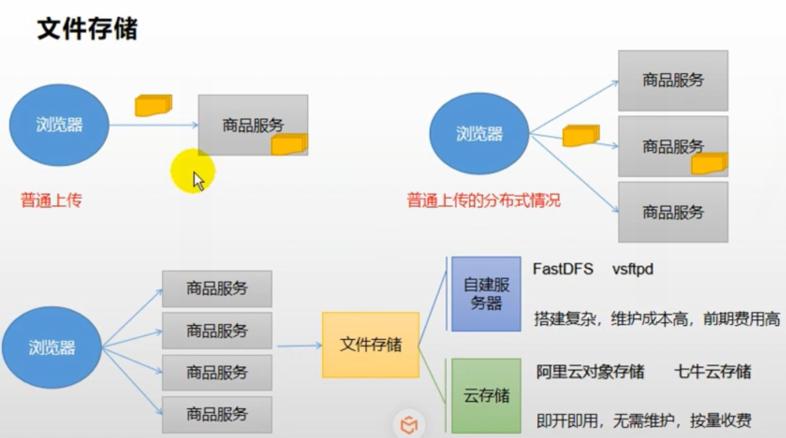
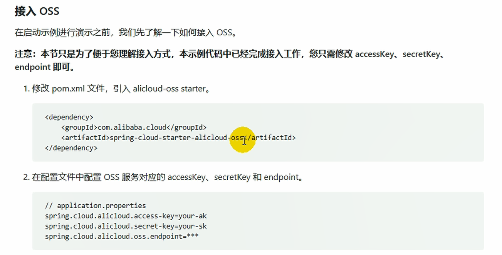

# 云存储


[toc]

------

## 1. 文件存储

* 单体应用的情况下和分布式应用是有很大不同的
  * 单体应用： 应用部署在一台服务器上，文件保存在当前项目的某个位置
  * 普通分布式服务：应用部署在多台服务器上，在微服务请求的过程中可能是负载均衡的访问某个服务，如果文件存在其中一个服务器上，下次访问可能会导致访问失败。
  * 上传文件存在在统一的文件系统中。 如下图最下面



## 2. 云存储开通与使用

本次开通的是阿里云，https://www.aliyun.com/product/oss；

### 2.1 简介 Spring Cloud Alibaba-OSS

​		对象存储服务（Object Storage Service, OSS）是一种海量、安全、低成本、高可靠的云存储服务，适合存在任意类型的文件。容量和处理能力弹性扩展，多种存储类型供选择，全面优化存储成功。


### 2.2 使用

* 基本上一个项目床架哪一个`bucket`


* 阿里云对象存储——普通上传方式

  * 用户通过客户端---->先上传应用服务器——Java代码，将图片的流数据提交——>对象存储OSS
  * 这种上传方式不好，因为文件上传的过程中要经过我们自己的服务，可能会造成系统瓶颈

* 阿里云对象存储——服务端签名后直传

  * 我们把OSS对象存储的账号密码还是存储在我们的应用服务器上

  * 1、 用户向应用服务器请求上传Policy，【应用服务器根据OSS账号密码生成防伪签名-授权令牌，上传地址等信息】

    2、应用服务器返回上传Policy

    3、用户直接上传数据到OSS

    


### 2.3 Java SDK

具体信息查看官方网站https://help.aliyun.com/document_detail/32009.html?spm=a2c4g.11186623.6.933.7ead46a1M2fzwv

1、安装SDK

```xml
<dependency>
    <groupId>com.aliyun.oss</groupId>
    <artifactId>aliyun-sdk-oss</artifactId>
    <version>3.10.2</version>
</dependency>
```

2、简单上传文件流

以下代码用于上传文件流

```java
// Endpoint以杭州为例，其它Region请按实际情况填写。
String endpoint = "http://oss-cn-hangzhou.aliyuncs.com";
// 云账号AccessKey有所有API访问权限，建议遵循阿里云安全最佳实践，创建并使用RAM子账号进行API访问或日常运维，请登录 https://ram.console.aliyun.com 创建。
String accessKeyId = "<yourAccessKeyId>";
String accessKeySecret = "<yourAccessKeySecret>";

// 创建OSSClient实例。
OSS ossClient = new OSSClientBuilder().build(endpoint, accessKeyId, accessKeySecret);

// 上传文件流。
InputStream inputStream = new FileInputStream("<yourlocalFile>");
ossClient.putObject("<yourBucketName>", "<yourObjectName>", inputStream);

// 关闭OSSClient。
ossClient.shutdown();
```

* endpoint的取值：


* accessKeyId和accessKeySecret需要创建一个RAM账号：


创建用户完毕后，会得到一个“AccessKey ID”和“AccessKeySecret”，然后复制这两个值到代码的“AccessKey ID”和“AccessKeySecret”。

* 另外还需要添加访问控制权限：


### 2.4 更为简单的使用方式，是使用Spring Cloud Alibaba-OSS



详细使用方法，见：

 https://help.aliyun.com/knowledge_detail/108650.html  

https://github.com/alibaba/aliyun-spring-boot/tree/master/aliyun-spring-boot-samples/aliyun-oss-spring-boot-sample

（1）添加依赖

```xml
        <dependency>
            <groupId>com.alibaba.cloud</groupId>
            <artifactId>spring-cloud-starter-alicloud-oss</artifactId>
            <version>2.2.0.RELEASE</version>
        </dependency>
```

（2）创建“AccessKey ID”和“AccessKeySecret”


（3）配置key，secret和endpoint相关信息

```yaml
      access-key: LTAI4G4W1RA4JXz2QhoDwHhi
      secret-key: R99lmDOJumF2x43ZBKT259Qpe70Oxw
      oss:
        endpoint: oss-cn-shanghai.aliyuncs.com
```


（4）注入OSSClient并进行文件上传下载等操作


但是这样来做还是比较麻烦，如果以后的上传任务都交给gulimall-product来完成，显然耦合度高。最好单独新建一个Module来完成文件上传任务。