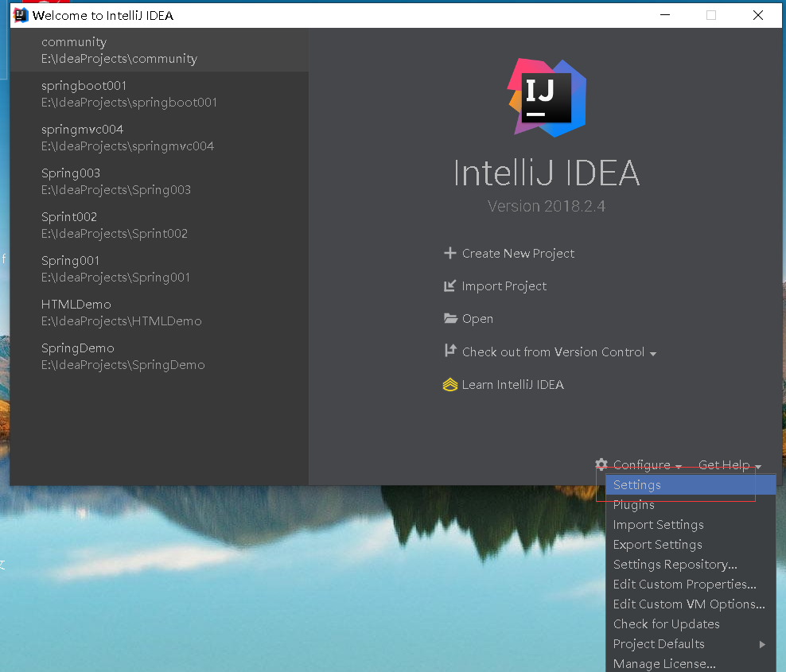
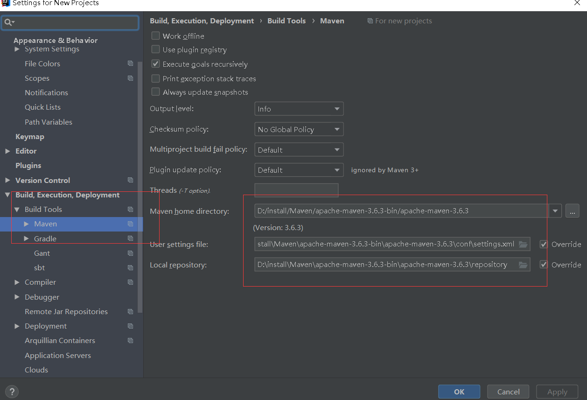

# 环境 开发环境&环境配置安装


[toc]

------

## 1. 版本

> * java -version	# java 版本 1.8
>* mvn -version 
>   * 安装maven，请[参考](https://www.cnblogs.com/liuhongfeng/p/5057827.html) 

### 2. 配置Maven

> * 将maven配置阿里云的镜像
>
>   ```xml
>   <mirrors>
>       <mirror>
>            <id>nexus-aliyun</id>
>            <mirrorOf>central</mirrorOf>
>            <name>Nexus aliyun</name>
>            <url>http://maven.aliyun.com/nexus/content/groups/public</url>
>         </mirror> 
>   </mirrors>
>   ```
>
> * 配置jdk1.8进行编译项目
>
>   ```xml
>   <profile>
>     <id>jdk-1.8</id>
>     <activation>
>       <activeByDefault>true</activeByDefault>
>       <jdk>1.8</jdk>
>     </activation>
>     <properties>
>       <maven.compiler.source>1.8</maven.compiler.source>
>       <maven.compiler.target>1.8</maven.compiler.target>
>       <maven.compiler.compilerVersion>1.8</maven.compiler.compilerVersion>
>     </properties>
>   </profile>
>   ```
>
>   

### 3. IDEA整合Maven，以及安装插件

> * 配置mvn
>
>   * 配置maven安装目录
>
>     
>
>     
>
> * 安装插件
>
>   * lombok：简化java bean的开发
>   * mybatisx: mybatis plus开发的一个 用于简化由mapper方法快速定位到xml文件

### 4. 前端开发工具vs code

> * 安装插件
>   * Auto close tag： 自动闭合 HTML / XML标签
>   * Auto rename Tag: 自动完成另一侧标签的同步修改
>   * Chinese(Simplified)
>   * ESlint: 
>   * HTML CSS Support:
>   * HTML Snippets:
>   * JavaScript(ES6) code snippets: ES6语法智能提示以及快速输入，除js外还支持.ts, .jsx, .tsx, .html, .vue， 省去了配置其支持各种包含js代码文件的时间
>   * live server: 实时服务器
>   * open in browser：在浏览器打开页面
>   * vetur：开发vue项目常用工具

### 5.  配置git

> ​	可以配置到github 或者 码云
>
> * 下载安装git客户端，配置环境变量
> * 配置git的用户名 和 邮箱
>   * git config --global user.name "username"
>   * git config --global user.email "username@emai.com"
> * 配置git ssh免密连接

### 6.  创建微服务项目

> * 创建一个总项目
>   * 总项目中包含多个字项目 （module）
>     * 多个子项目之间  group 保持相同：如 com.huawei.hxx
>     * 多个子项目之间的 artifact 可以过 hxx-product /  hxx-ware等进行区分
>   
> * 修改总模块的.gitignore文件
>
>   ```shell
>   **/mvnw						# 忽略任意路径下mvnw文件
>   **/mvnw.cmd
>   **/.mvn
>   **/target
>   .idea
>   **/.gitignore
>   ```
>
> * 将 `项目初始化结构相关文件` push 到github 或者 码云仓库