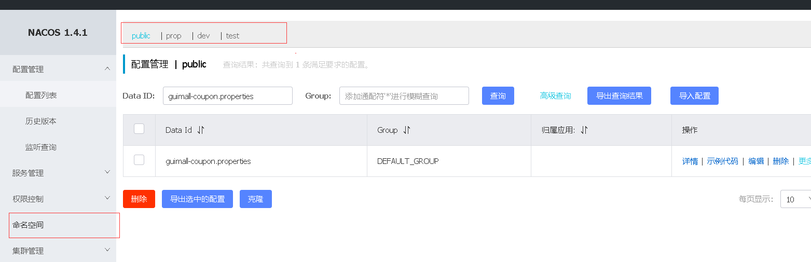

# 分布式组件

[toc]

------


### 1. 搭建分布式系统的基本环境

> * 微服务： `注册中心、配置中心、网关`
>   * `注册中心`：每个微服务的上线，都需要将各个微服注册到 注册中心。
>     * Eureka，spring cloud alibaba nacos
>   * `配置中心`：各个微服务配置众多，一个配置中心集中管理配置。
>     * sping cloud config，spring cloud alibaba nacos
>   * `API网关`：所有的前端的请求，先经过网关，进行统一的鉴权、过滤、路由等等。由网关抵达给其他的服务，做一些预先的工作
>     * zuul, Gateway

### 2. spring cloud alibaba组件

> * **简介**
>
>   spring cloud alibaba 致力于提供微服务开发的一站式解决方案。此项目包含开发分布式应用微服务的必需组件，方便开发者通过Spring cloud 编程模型轻松使用这些组件来开发分布式应用服务。
>
>   依托Spring cloud alibaba，`您只需要添加一些注解 和 少量的配置`，就可以将Spring cloud 应用接入阿里微服务解决方案，通过阿里中间件来迅速搭建分布式应用系统。
>
>   http://www.github.com/alibaba/spring-cloud-alibaba
>
> * **为什么使用**
>
>   原因之一：eureka停止维护等
>
>   `springCloud 的几大痛点：`
>
>   * springcloud部分组件停止维护和更新，给开发带来不便。`比如`Eureka，而且netflix的好多组件也停止了开源
>   * springcloud部分环境搭建复杂，没有完善的可视化界面，我们需要大量的二次开发和定制。`如`：服务熔断要一些可视化界面，但是不完善。
>   * springcloud配置复杂，难以上手，部分配置差别（比较细）难以区分和合理应用。
>
>   
>
>   `springCloud alibaba的优势`
>
>   * 阿里使用过的组件经历了考验，性能强悍，设计合理，现在开源出来大家用成套的产品搭配完善的可视化界面给开发运维带来极大的便利。 搭建简单，学习曲线低
>   * <font color=red>**结合Spring cloud Alibaba,我们最终的技术搭配方案**</font>
>     * SpringCloud Alibaba - Nacos: 注册中心 （服务发现/注册）
>     * SpringCloud Alibaba - Nacos: 配置中心  （动态配置管理）
>     * SpringCloud - Ribbon: 负载均衡
>     * SpringCloud - Feign: 声明式HTTP客户端 （调用远程服务）
>     * SpringCloud Alibaba - Sentinel: 服务熔断 （限流、降级、熔断）
>     * SpringCloud - Gateway:  API网关 （webflux编程模型）
>     * SpringCloud - Sleuth: 调用链监控
>     * SpringCloud Alibaba - Seata: 原Fescar，即分布式事务解决方案  
>
> * **版本选择**
>
>   * 由于spring boot 1 和 spring boot 2在Actuator模块的接口和注解有很大的变更，且spring-cloud-commons从1.x.x 版本升级到2.0.0版本也有较大的变更，因此我们采取跟SpringBoot版本一致的版本：
>     * 1.5.x 版本适用于 spring boot 1.5.x
>     * 2.0.x 版本适用于 spring boot 2.0.x
>     * 2.1.x 版本适用于 spring boot 2.1.x
>
> * **怎么使用？**
>
>   * 项目中添加依赖：
>
>     可以在common项目中引入，进行统一的管理
>
>     ```xml
>     <!-- 
>     如果需要使用已发布的版本，在 dependencyManagement 中添加如下配置。
>     依赖管理：以后再dependency 引入alibaba的依赖就不用写版本号了，全被这个进行管理
>     然后在 dependencies 中添加自己所需使用的依赖即可使用。
>     -->
>     <dependencyManagement>
>         <dependencies>
>             <dependency>
>                 <groupId>com.alibaba.cloud</groupId>
>                 <artifactId>spring-cloud-alibaba-dependencies</artifactId>
>                 <version>2.2.5.RELEASE</version>
>                 <type>pom</type>
>                 <scope>import</scope>
>             </dependency>
>         </dependencies>
>     </dependencyManagement>
>     ```

### 3. 分布式组件---SpringCloud Alibaba-Nacos注册中心

> Nacos是阿里巴巴开源的一个更易于构建云原生应用的动态服务发现、配置管理和服务管理平台，他是使用Java编写，需要依赖Java环境。
>
> Nacos文档地址：https://nacos.io/zh-cn/docs/quick-start.html，https://github.com/alibaba/spring-cloud-alibaba/blob/master/spring-cloud-alibaba-examples/nacos-example/nacos-discovery-example/readme-zh.md
>
> 1. 下载nacos-server，启动nacos
>
>    [下载地址](https://github.com/alibaba/nacos/releases)
>
> 2. 添加依赖:服务的注册、发现
>
>    ```xml
>     <dependency>
>         <groupId>com.alibaba.cloud</groupId>
>         <artifactId>spring-cloud-starter-alibaba-nacos-discovery</artifactId>
>     </dependency>
>    ```
>
> 3. 在应用的 /src/main/resources/application.properties 配置文件中配置 Nacos Server 地址
>
>    ```yaml
>    spring.cloud.nacos.discovery.server-addr=127.0.0.1:8848 # 配置nacos服务地址
>    spring.application.name= xxx 							# 配置注册到nacos服务器的项目名称
>    ```
>
> 4. 使用 @EnableDiscoveryClient 注解开启服务注册与发现功能
>
>    ```java
>     @SpringBootApplication
>     @EnableDiscoveryClient
>     public class ProviderApplication {
>    
>     	public static void main(String[] args) {
>     		SpringApplication.run(ProviderApplication.class, args);
>     	}
>     }
>    ```
>
> 5. 启动项目，并且查看127.0.0.1:8848/nacos 查看是否注册成功

### 4 分布式组件---SpringCloud OpenFeign 测试远程调用

> 1. **简介**
>
>    Feign是一个声明式的HTTP客户端，它的目的就是让远程调用更加简单。Feign提供了HTTP请求的模板，**通过编写简单的接口和插入注解**，就可以定义好HTTP请求的参数、格式、地址等信息。
>
>    **Feign整合了Ribbon（负载均衡）和 Hystrix(服务熔断)**，可以让我们不再需要显示地使用这两个组件。
>
>    SpringCloud Feign在netflix的基础上扩展了对SpringMVC注解的支持，在其实现下，我们只需要创建一个接口并用注解的方式来配置它，即可完成对服务提供方的接口绑定，简化了SpringCloud Ribbon自行封装服务调用客户端的开发配置。
>
> 2. **使用**
>
>    * 引入openfeign的依赖
>
>    * 编写一个接口，告诉SpringCloud这个接口需要调用远程服务
>
>      * 声明接口的每一个方法都是调用哪个远程服务的那个请求
>
>      ```java
>      // 1. 创建feign包
>      // 2. @FeignClient("服务名") 调用远程服务, 服务名为注册到nacos上的名称
>      // 3. 将远程调用方法的完整签名拷贝过来，注意请求路径的完整性
>      package com.atguigu.glimall.member.feign;
>      @FeignClient("guimall-coupon")
>      public interface CouponService {
>          @RequestMapping("/coupon/coupon/list")
>          R list(@RequestParam Map<String, Object> params);
>      }
>      ```
>
>    * 开启远程调用功能
>
>      * @EnableFeignClients(basePackages = "")

### 5. 分布式组件---SpringCloud Alibaba Nacos配置中心

> ##### 一、使用
>
> * 添加依赖：配置中心来做配置管理
>
>   ```xml
>    <dependency>
>        <groupId>com.alibaba.cloud</groupId>
>        <artifactId>spring-cloud-starter-alibaba-nacos-config</artifactId>
>    </dependency>
>   ```
>
> * 在应用的 /src/main/resources/bootstrap.properties 配置文件中配置 Nacos Config 元数据
>
>   **/src/main/resources/bootstrap.properties是springboot规定的，优先于application.properties先读取**
>
>   ```xml
>    spring.application.name=nacos-config-example <!-- 应用的名称 -->
>    spring.cloud.nacos.config.server-addr=127.0.0.1:8848
>   ```
>
> * 完成上述两步后，应用会从 Nacos Config 中获取相应的配置，并添加在 Spring Environment 的 PropertySources 中。这里我们使用 @Value 注解来将对应的配置注入到 SampleController 的 userName 和 age 字段，并添加 @RefreshScope 打开动态刷新功能
>
>   **曾经的做法：应用上线之后，想修改源代码配置文件中name 或者 age，重新将应用打包发布，并重新启动。比较麻烦**
>
>   ```java
>    // @RefreshScope
>    class SampleController {
>   
>    	@Value("${sample.user.name}")
>    	String userName;
>   
>    	@Value("${sample.user.age}")
>    	int age;
>    }
>   
>   // 在application.properties声明如下
>   sample.user.name=xxx
>   sample.user.age=18
>   ```
>
>   **在nacos配置中心配置：**
>
>   * 数据集（Data ID）: 默认规则： 应用名称.properties
>   * 配置格式选择：properties
>   * 然后将配置信息填写
>   * 最后点击发布
>     * **注意：动态获取配置@RefreshScope刷新配置，每次从配置配置中心获取配置**
>     * 如果配置中心和当前应用的配置文件中都配置了相同的项，优先使用配置中心的配置
>
>   <font color=green>如果nacos配置中心未生效，请查看 `配置 & 运行过程中出现的问题2`</font>
>
>   
>
> ##### 二、nacos配置中的更多细节
>
> * **命名空间**
>
>   *用于进行租户粒度的**配置隔离***。不同的命名空间下，可以存在相同的group 或 Data Id的配置。Namespace的常用场景之一是不同环境的配置的区分隔离，例如开发测试环境和生产环境的资源（如配置、服务）隔离等。
>
>   默认：public(保留空间)：默认新增的所有配置都在public空间
>
>   1. 开发(dev)，测试(test)，生产(prod): 利用命名空间来做环境隔离
>
>      注意：在bootstrap.properties 配置上，需要使用哪个命名空间下的配置
>
>      ```properties
>      spring.application.name=guimall-coupon
>      spring.cloud.nacos.config.namespace=841f4e70-e67f-4d33-b943-294826093535 # 只能写ID不能写prop等名字
>      spring.cloud.nacos.config.server-addr=127.0.0.1:8848
>      ```
>
>      
>
>   2. 每个微服务之间互相隔离配置，每个微服务都创建自己的命名空间，只加载自己命名空间下的所有配置
>
>      <font color=red>**每个微服务创建自己的`命名空间`，使用`配置分组`区分环境，`dev,test,prod`**</font>
>
> * **配置集**：所有配置的集合
>
>   一组相关或者不相关的配置项的集合称为配置集。在系统中，一个配置文件通常就是一个配置集，包含了系统各个方面的配置。例如，一个配置集可能包含了数据源、线程池、日志级别等配置
>
> * **配置集ID**：类似于配置文件名
>
>   Nacos中某个配置集的ID。配置集ID是组织划分配置的维度之一。**Data ID**通常用于组织划分系统的配置集。一个系统或者应用可以包含多个配置集，每个配置集都可以被一个有意义的名称标识。Data ID通常采用Java包（如 com.taobao.tc.refund.log.level) 的命名规则保证全局的唯一性。此命名规则非强制。
>
> * **配置分组**
>
>   Nacos中的一组配置集，是组织配置的维度之一。通常一个有意义的字符串（如Buy或Trade）对配置集进行分组，从而区分Data ID相同的配置集。当您在Nacos上创建一个配置时，如果未填写配置分组的名称，则配置分组的名称默认采用`DEFAULT_GROUP`。配置分组的常见场景，不同的应用或组件使用了相同的配置类型。如`database_url`配置和`MQ_topic`配置。
>
>   默认所有的配置都属于：`DEFAULT_GROUP`
>
>   group分组可以根据双十一、双十二等进行分组
>
>   ```properties
> spring.application.name=guimall-coupon
>   spring.cloud.nacos.config.server-addr=127.0.0.1:8848
>   spring.cloud.nacos.config.namespace=841f4e70-e67f-4d33-b943-294826093535
>   spring.cloud.nacos.config.group=1111
>   ```
>   
>   
>
>   ##### 三、从配置中心同时加载多个配置集
>
> 随着业务的不断壮大，微服务可能有非常多的配置，我们不可将将所有配置写到一个配置文件中，这样这个配置文件中的内容又多又乱不好维护。一般做法是拆分出不同的配置文件，比如: 数据源相关配置、框架相关配置、微服务相关配置等
>
> 1)  微服务任何配置信息，任何配置文件都可以放在配置中心中
>
> 2）只需要在bootstrap.properties说明加载配置中心哪些配置文件即可
>
> 3）@value, @ConfigurationProperties。以前springboot任何方式从配置文件获取值，都能使用。配置中心有的有限使用
>
> ```properties
>spring.application.name=guimall-coupon
> spring.cloud.nacos.config.server-addr=127.0.0.1:8848
> spring.cloud.nacos.config.namespace=841f4e70-e67f-4d33-b943-294826093535
> spring.cloud.nacos.config.group=prod
> spring.cloud.nacos.config.extension-configs[0].data-id=datasource.yml # 某个分组下的配置
> spring.cloud.nacos.config.extension-configs[0].group=dev            # 哪个分组
> spring.cloud.nacos.config.extension-configs[0].refresh=true         # 是否动态刷新
> spring.cloud.nacos.config.extension-configs[1].data-id=mybatis.yml 	# 某个分组下的配置
> spring.cloud.nacos.config.extension-configs[1].group=dev            # 哪个分组
> spring.cloud.nacos.config.extension-configs[1].refresh=true         # 是否动态刷新
> spring.cloud.nacos.config.extension-configs[2].data-id=other.yml 	# 某个分组下的配置
> spring.cloud.nacos.config.extension-configs[2].group=dev            # 哪个分组
> spring.cloud.nacos.config.extension-configs[2].refresh=true         # 是否动态刷新
> ```
> 
> 

### 6 分布式组件---SpringCloud Gateway网关核心概念&原理

> 1. **简介**
>
>    网关作为流量的入口，常用的功能包括路由转发、权限校验、流量控制等。而springcloud gateway作为springcloud官方推出的第二代网关框架，取代了Zuul（netflix公司提供）网关。
>
>    网关提供API全托管服务，丰富的API管理功能，辅助企业管理大规模的API，以降低管理成本和安全风险，包括协议适配、协议转发、安全策略、防刷、流量、监控日志等功能。
>
>    SpringCloud Gateway旨在提供一种简单而有效的方式来对API进行路由，并未他们提供切面，例如：安全性，监控/指标 和弹性等。
>
>    官方文档地址：
>
>    https://docs.spring.io/spring-cloud-gateway/docs/current/reference/html/
>
> 2. 使用
>
>    * 创建网关的项目
>    * 开启服务的注册发现
>      * 配置nacos的注册中心地址以及应用名称
>      * 添加配置中心文件bootstrap.properties: 添加配置中心地址等信息
>      * 添加@EnableDiscoveryClient启动服务注册及发现
>      * 添加@SpringBootApplication（exclude = {DataSourceAutoConfiguration.class}）排除数据源相关配置
>
>    **使用样例如下：**
>
>    ```yaml
>    # 1. 配置nacos注册中心 										【application.properties文件】
>    spring.cloud.nacos.discovery.server-addr=127.0.0.1:8848
>    server.port=88
>    spring.application.name=guimall-gateway
>    #2. 配置nacos 配置中心 										【bootstrap.properties文件】
>    spring.cloud.nacos.config.server-addr=127.0.0.1:8848
>    spring.application.name=guimall-gateway
>    spring.cloud.nacos.config.namespace=d423ae67-0cf5-4e88-8d50-571e4bc720ec #该项目在nacos上命名空间的id
>    # 3. 配置gateway 												【application.yml文件】
>    spring:
>      cloud:
>        gateway:
>          routes:
>            - id: test_route # 每个路由都有唯一的id
>              uri: https://www.baidu.com
>              predicates:
>              - Query=url,baidu
>            - id: qq_route
>              uri: https://www.qq.com
>              predicates:
>              - Query=url,qq
>    # 4. 添加服务发现注册和发现注解 									【xxxApplication.java】
>    @EnableDiscoveryClient # nacos服务的注册与发现 
>    @SpringBootApplication(exclude = {DataSourceAutoConfiguration.class}) # 排除数据源相关配置
>    public class GuimallGatewayApplication {xxx}
>    # 5. 运行服务 & 测试
>    http://localhost:88?url=qq 或者http://localhost:88?url=baidu 或者http://localhost:88/?url=baidu等
>    ```
>
>    
>
>    


### * 配置 & 运行过程中出现的问题

> 1. java.lang.AbstractMethodError: org.springframework.cloud.netflix.ribbon.RibbonLoadBalancerClient.choose
>
>    ```xml
>    出现这个问题是没有loadbalanc，但是nacos中ribbon会造成loadbalanc包失效
>    在common的pom文件中加入
>    <dependency>
>        <groupId>com.alibaba.cloud</groupId>
>        <artifactId>spring-cloud-starter-alibaba-nacos-discovery</artifactId>
>        <exclusions>
>            <exclusion>
>                <groupId>org.springframework.cloud</groupId>
>                <artifactId>spring-cloud-starter-netflix-ribbon</artifactId>
>            </exclusion>
>        </exclusions>
>    </dependency>
>    <dependency>
>        <groupId>org.springframework.cloud</groupId>
>        <artifactId>spring-cloud-loadbalancer</artifactId>
>        <version>2.2.2.RELEASE</version>
>    </dependency>
>    ```
>
> 2. nacos配置中心未生效
>
>    可能是因为springboot  springCloud 以及 SpringCloud Alibaba版本问题。全部修改为2.2.5.RELEASE 功能验证ok
>
>    **我这边初始版本**
>
>    ​		**SpringBoot 2.4.2**  
>
>    ​		**Spring Cloud 2020.0.1**  
>
>    ​		**Spring Cloud Alibaba 2.2.5.RELEASE**
>
>    **全部修改为**
>
>    ​		**SpringBoot 		2.2.5.RELEASE**  
>
>    ​		**Spring Cloud 	2.2.5.RELEASE**  
>
>    ​		**Spring Cloud Alibaba 2.2.5.RELEASE**
>
>    ​	或者
>
>    ​		**SpringBoot 				2.1.8.RELEASE**  
>
>    ​		**Spring Cloud 				Greenwich.SR3**  
>
>    ​		**Spring Cloud Alibaba 	2.1.0.RELEASE**